# 多视角篮球数据集

## Step1-视频片段提取

### 任务介绍

1. 要求检查每一个片段，找到包含**全体球员**（每队5人，共10人）的片段，将这些片段裁剪保存下来。
2. 每一次投篮进攻，通常包含多个视角的回放。如果其中有多个视角均满足筛选条件（包含全体球员），则这几个视角均裁剪保存，其他不包含全体球员的视角舍去。

### 准备工作

1. 下载前缀为自己名字的原始视频素材压缩包，解压得到两个文件夹。第一个是原始未处理的视频数据，另一个是筛选得到目标视频片段之后的文件保存目录。

   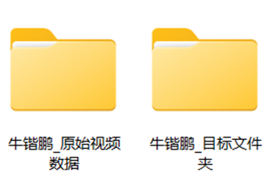

   两个文件夹的目录结构是一样的，从某一个原始视频中裁剪出符合要求的目标片段之后，只需要保存到“目标文件夹”目录中的对应文件夹中即可。

   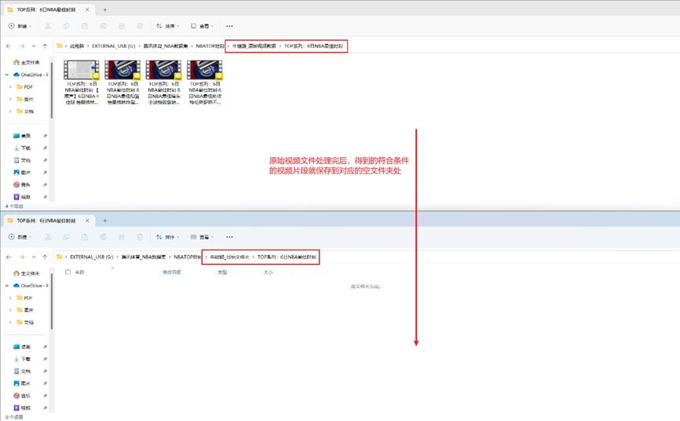

2. 解压附件1，得到LosslessCut软件文件夹，双击`LosslessCut.exe`打开软件。

   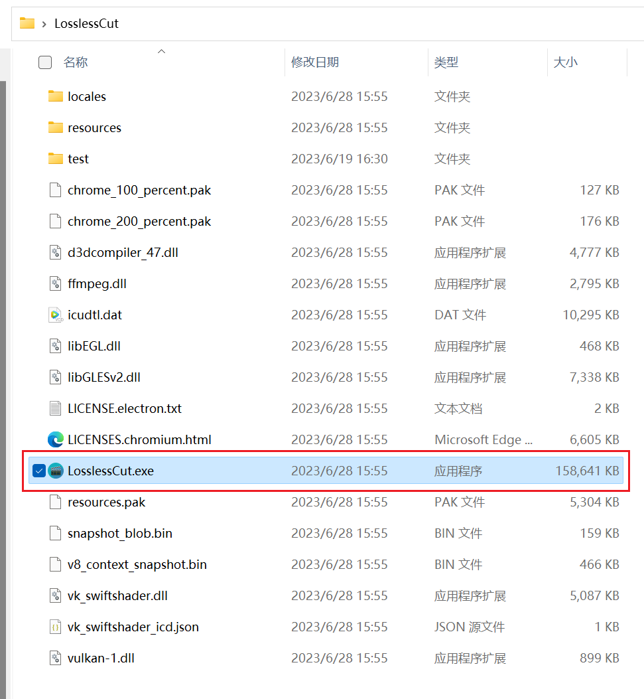
3. 进行软件的部分选项设置。按如图方式，设置语言为中文，并关闭`自动保存项目文件`选项。
   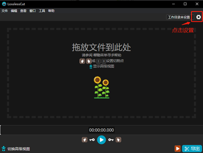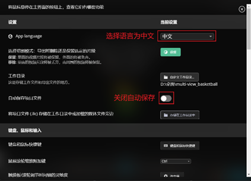

### 可用片段筛选

1. 将需要处理的视频拖入软件打开。
   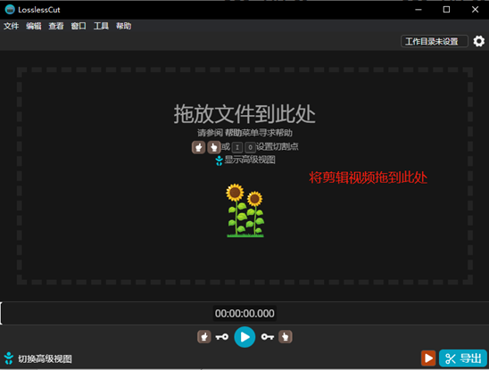

2. 找到视频的每个片段中，包含全部球员的片段，按如图方式剪取该片段。每一球一般会有1-2次回放，即包含2-3个视角，如果多个视角均包含全部球员，则每个视角都要剪取。
   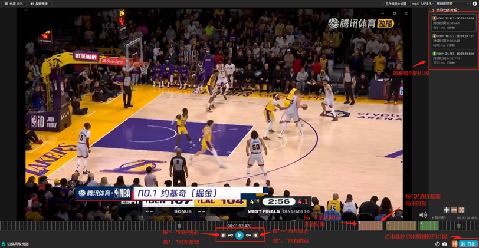

3. 将裁剪好的视频右键保存到对目标文件夹的对应位置。
   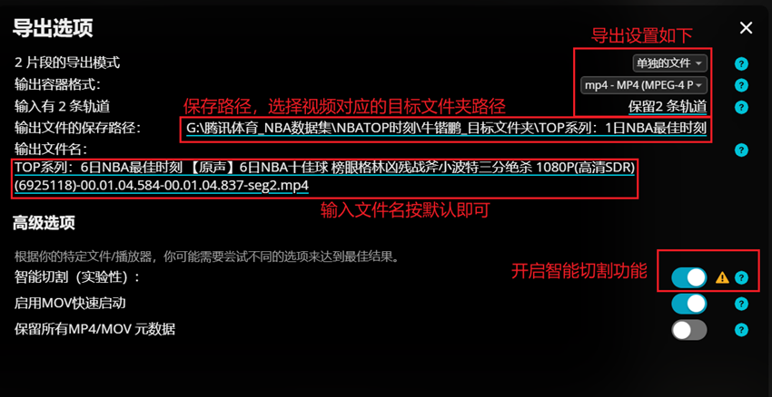

4. 注意事项
   1. 在最佳镜头/扣篮/助攻中，可能会含有部分前面的十佳/五佳球已经裁剪过了的片段，此时注意不要再重复保存。
      

   2. 如果对于同一次进攻投篮，有多个视角均符合条件，则筛选保存之后，需要对保存下的文件进行重命名。重命名格式为，在原来的文件名后加上“-view1”，“-view2”，……以此类推。
      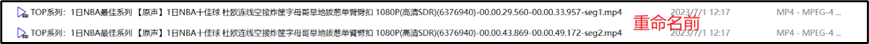
      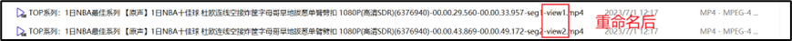

5. 视频处理示例：文件中附带了一个原始视频及处理后得到的符合要求的视频片段示例，可以作为参考。
   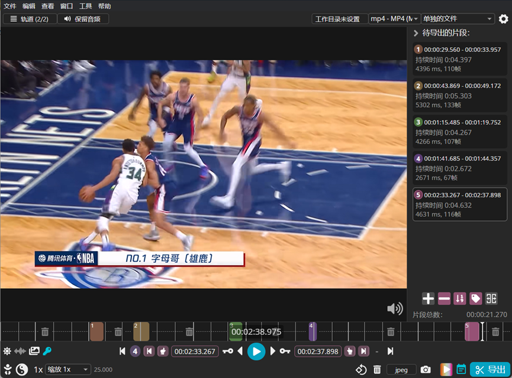
   同时附上几张筛选过程中的操作截图。
   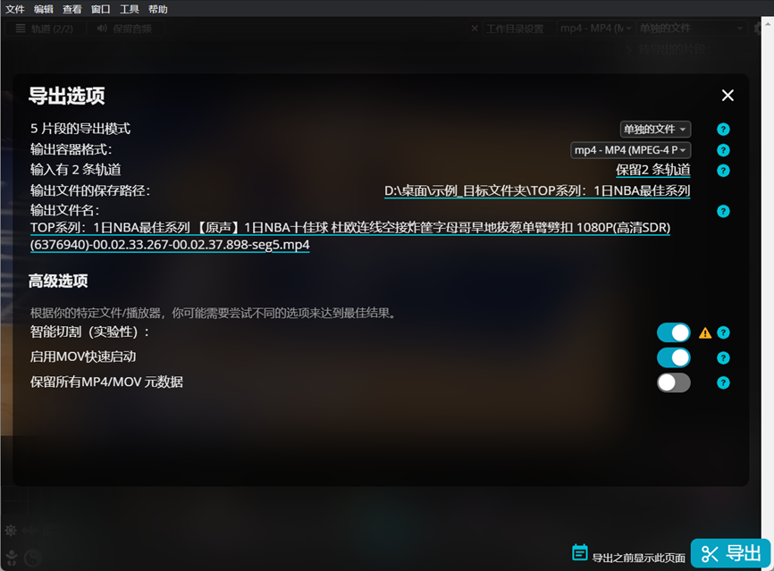
   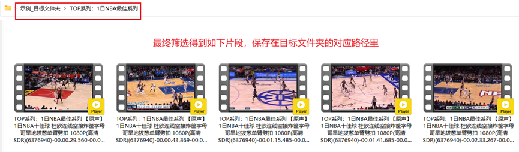
