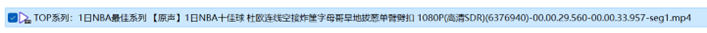
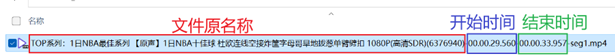
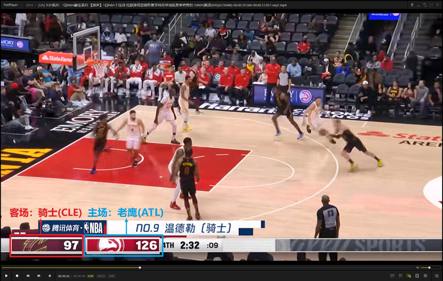
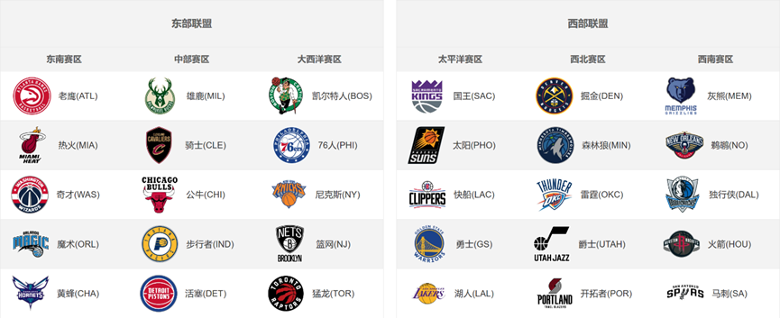
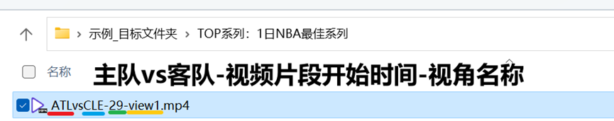
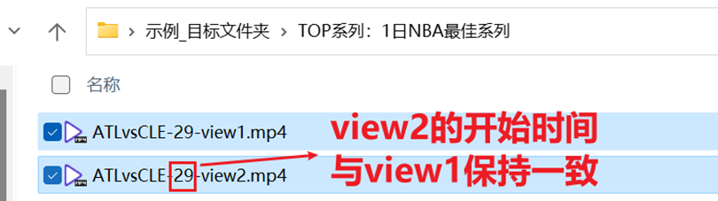

# 多视角篮球数据集

## Step2-片段重命名

### 任务介绍

需要对第一阶段筛选得到的投篮视频片段，需要进行规范化的重命名工作。重命名格式为：“主队名称vs客队名称-视频片段开始时间（以秒为单位）-视角名称.mp4”。下面会通过对一个片段的重命名过程介绍来进行详细说明。

### 重命名流程

1. 示例片段的原名称如图。

   

   1. 我们仔细观察该命名格式，由几个部分组成：**文件原名称**-**片段在原视频中的开始时间**-**片段在原视频中的结束时间**。我们需要记住的是**开始时间**，如图为00.00.29.560，如舍去小于秒的:部分，则表示在原视频中，该片段开始于**第29秒**。

   

2. 随后，我们双击打开视频，观察确认该片段中比赛的主场球队及客场球队。确认规则为，计分板上，**左边的是客场队伍**，**右边的是主场队伍**。
   

   同时，我们需要对照下方的球队徽标示例，确认具体的球队名称及对应的英文缩写。例如，在上图，我们可以通过对照球队徽标示例，确定客场为骑士队，英文缩写为CLE；主场为老鹰队，缩写为ATL。
   

   需要注意的是，由于队徽更新等原因，部分视频片段中，球队徽标可能与上图示例并不完全一致，此时需要自己再进行查证，或借助视频中的文字信息等进行判断。如确实无法判断的，需要咨询标注任务发布者确定。

3. 根据以上信息，我们应将视频片段文件重命名为如图。
4. 

   其中，“29”由原名称中开始时间“00.00.29.560”确定，为29秒。又假设，如果原名称中开始时间为“00.01.19.752”，即1分19秒，则重命名后的开始时间应为60+19=79秒（即把分也统一换算成秒）。

   其中，“view1”为视角的名称。大多数情况下，一次进攻只有一个视角，则直接命名为“view1”即可。若包含多个视角，则依次重命名为“view1”“view2”……即可。同时需要注意，view2及以后的片段，开始时间与view1保持一致即可。如下图示例。
   

   重命名后格式如下图。
   
