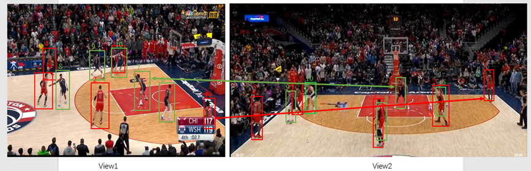

# 多视角篮球数据集

## Step3-关键帧提取及标注

### 任务介绍

需要将经过了筛选和重命名后的投篮视频片段切帧，并按要求提取5个关键帧，进行球员的编号和行为标注。最后，确定投篮球员的编号，并进行二次重命名。

### 准备工作

1. 对于每一个视频片段，首先创建一个与之同名的文件夹。（如果某一次进攻有多个视角，及view1，view2等的，每个视角也是创建对应的同名文件夹，独立进行后续步骤处理）。
   
2. 进入该文件夹，将视频片段复制一份至此文件夹。然后，新建三个文件夹，分别命名为“frames”，“keyframes”，“labels”，如图。
   

### 步骤1：视频片段切帧

需要把视频片段由mp4格式提取为jpg格式的关键帧，并存放在对应的frames文件夹中。

1. 打开附件2（mp4切帧工具.exe)。
   
2. 选择需要转换为帧的视频片段，然后设置导出路径为对应文件夹中的“frames”文件夹，点击`转换视频为JPG`进行帧导出。
   
3. 导出完成后，软件会有弹窗提示。此时进入frames文件夹检查，发现已将视频导出为帧。
   

### 步骤2：关键帧选取

需要按照以下要求，从提取到的所有帧中选出5个关键帧，作为后续标注的对象。

1. 需要的5个关键帧分别为：

   - 视频的第一帧

   - 投篮球员接球的第一帧

   - 投篮球员准备投篮的第一帧

   - 投篮球员投篮的第一帧

   - 投篮球员投篮动作结束的第一帧

2. 选取得到的每一帧，均要求**包含所有球员**（10个人），否则后续无法对此关键帧进行完整标注，无法利用。

   如果需要选取的那一帧无全体球员，但其临近的一帧满足要求，也可以借用满足条件的一帧作为关键帧。

   如果确实无法找到满足要求的帧，**则该视频片段应当直接舍弃**。

3. 以下为选取五个关键帧的具体说明及图片示例。

   1. 视频第一帧：取投篮视频刚开始的第一帧。
      

   2. 投篮球员接球时的第一帧：
      1. 如果由其他球员传球给投篮球员，则选择投篮球员接到球的第一帧。
      2. 如果投篮球员自己持球，则选择投篮球员运球的第一帧。
      3. 如果这一帧恰好为视频的第一帧，例如，视频一开始就是投篮球员自己在运球，则可适当延后几帧作为此处选取的帧。
      

   3. 投篮球员准备投篮时的第一帧：
      1. 对于投篮，取球员有投篮的起手动作的一帧。
      2. 对于上篮、扣篮等无投球起手动作的情况，取球员双手合球的一帧，或从运球改为托球的一帧，此时标志上篮、扣篮动作将开始。
      3. 对于空接扣篮等以上约定均无法判断的情况，**直接舍弃片段**。
      

   4. 投蓝球员投篮时的第一帧：
      1. 对于投篮，取球员将球投出，球离开手的一帧。
      2. 对于上篮、扣篮等无投球离手的情况，取上篮、扣篮时球员手臂伸直的一帧。
      

   5. 投篮结束帧：
      1. 对于投篮，取球员投篮动作结束的一帧。
      2. 对于上篮、扣篮等无投篮动作的情况，取球离开篮筐的一帧。
      

4. 对选取得到的关键帧，**复制一份**至“keyframes”文件夹中。请注意，是**复制**而不是**剪切**。

5. 提示：在选取5个关键帧时，为了方便观察球员动作变化，可以按图示方法打开“预览窗格”，方便预览图片，并按方向键切换图片。
   

### 步骤3：关键帧标注

对上一步骤中选取得到的5个关键帧，进行球员位置以及行为的标注。

1. 解压附件3，得到DarkLabel软件文件夹，双击`DarkLabel.exe`打开软件。
   

2. 点击`Open Image Folder`，选择存放关键帧的文件路径，导入关键帧。
   

3. 开始进行标注，如果图片尺寸过大屏幕无法完全显示，可以从图片左上角拖动缩放图片。

4. 配置标注工具属性：选择`pascal voc`文件格式，选择`Popup LabelSelect`标注模式，点击`Save Settings`保存配置。
   

5. 开始标注，对每个关键帧中十个运动员，依次选择符合实际情况的球员行为和其对应ID。标注框要求包含球员所有部位，并且框尽可能小（框和行人间隙保持3mm内）。具体的球员行为及ID确定原则见下文。
   

6. 球员行为确定原则：
   1. `standing`：指球员站立不动，或缓慢走动（只要速度达不到running）。
   2. `running`：指球员跑动。
   3. `defense`：指在防守持球进攻球员的防守球员。defense的优先级高于standing和running，即防守持球进攻球员的防守球员无论静止还是跑动，均优先标记为defense。可以有多为球员为defense状态，也可以无defense状态球员，以实际情况为准。
   4. `holding`：指当前持球进攻球员的状态。holding的优先级高于standing和running，即持球进攻球员无论静止还是跑动，均优先标记为holding。同一时刻应只有一位球员持球，即只有一人状态标记为holding。

7. 球员ID确定原则：
   1. **在第1个关键帧中**，将球员ID确定为1-10。其中，对于进攻方的5名球员，按照在画面中位置从下到上的顺序，依次编号为1-5；对于防守方的5名球员，按照在画面中位置从下到上的顺序，依次编号为6-10。
   

   2. 标注完第1个关键帧后，**随后的4个关键帧**，球员ID应与第1帧**一一对应**。
8. 

   1. 如果包含多个视角的，在view1中确定每个球员的ID后，其他视角标注时需要保证与view1中的球员ID一致。例如：

      view2标注时与view1对齐：
      

      view3标注时与view1对齐：
      

9. 第一帧标注完成后，点击`Next & Predict`，开始标注下一帧。进入下一帧后，会有一些该软件算法预测的标注框，**检查预测的标注框位置和标签是否正确，以及是否与第一帧的球员ID对齐**。正确则保留，不正确则对标记框按`Shift+鼠标右键`删除，重新对该球员进行标注。

10. 五个关键帧均标注完成后，点击`GT Saveas`选择label保存位置，保存完成后会在“labels”文件夹中生成对应的关键帧标注文件。
    

11. 注意事项

    1. 每次对某一帧进行检查及重新标注后，要按`Ctrl+s`保存修改后的帧的标注信息。
    2. 如果遇到有部分球员被其他球员挡住了一部分，则标注框时，需要自己大致估计球员的位置进行标注，框出该球员的大概位置。

### 步骤4：二次重命名

1. 观察投篮关键帧，**确定投篮球员ID**。例如，假设本段视频的投篮关键帧中可以看到最后投篮球员的ID为3，则整段视频的最后投篮球员标签为3。
   
   1. 进行二次重命名：将该视频片段及所在的文件夹进行二次重命名，格式为，加上“-投篮球员ID”。如图，本视频片段重命名后应加上“-3”。
      
